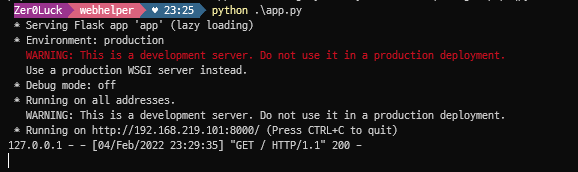

# Web Application Logical Bug Fuzzer (BrainBreak)

### Intro

 In today's web application environment, as many third parties or frameworks are combined, small issues or developer mistakes are increasing. Other client-side vulnerabilities can be addressed through existing fundamental security techniques, but logical bug cases cannot be easily defended. It feels like a backdoor. We have developed a fuzzer that can detect other logical bugs from existing web fuzzers and plugins. I applied the necessary skills to understand my own web logic while easily solving the CTF. (API analysis, business logic, script execution vector,...) Using this technology and the case of exporting important functions to the window object that developers often miss, and the case of using it as a query, query and data are collected when a normal URL is requested. After sending a combination of data, it is possible to detect a crash based on the response value.

### Featured

- Web application logic bug issue automation analysis function
- Fuzzer using externally exposed objects during deployment
- Extraction of internal weak logic bug script gadget
- All URL parsing analysis work when rendering the target client
- Use traffic for necessary tasks

### ENV TETS

```java
OS: Window 
python 3.9.9
pip 21.3.1
```

### requirement

```java
beautifulsoup4==4.10.0
Flask==2.0.2
Flask-Bootstrap==3.3.7.1
Flask-Login==0.5.0
Flask-SocketIO==4.3.2
Jinja2==3.0.3
requests==2.27.1
Werkzeug==2.0.2
```

### Struct

- The CXX class uses the `get_all_url_parse` API to parse the target client rendering URL and store the state. The `cehck_method` API makes a request with the `options` method based on the collected data and analyzes the header of the response value to determine the current security settings and internal state information.
- The `inner_script_gadget` API collects the inner script information by requesting a list of URLs from which the information is collected, and uses the window object to identify the export pattern.

```java
CXX class
```

- This PTP class is for fuzzer work. This is for data manipulation and status check of normal URLs based on the previously collected information. The `seed_pool` API determines whether a window object exists based on the collected data and performs the seed pool operation for deduplication.
- The `mutation` API creates a testcase using the data of the seed, determines whether the query data is ?, &, determines whether it is GET or POST, secures random data based on this, and inserts the previously collected data to perform the mutation operation. Proceed.
- `ptpfuzz` The final fuzzer work is carried out and crash judgment is proceeded based on the status code.

```java
PTP class
```

### Run

- Execute the [app.py](http://app.py/) script after installing the necessary packages

```java
python app.py
```

- Connect to flask server (when changing the port, edit the [app.py:108](http://app.py:108/) line and run it)



- Wait until loading is complete (analysis in progress)


- When the Finish PTP Fuzzing message appears on the CLI window, check the completion and web server


## DashBoard Layout

- Target INPUT (METHOD, SCHEMA, HOST, DATA)


- Logical BugFuzzer Crash


- Security Check


- Logical Bug InnerScript Gadgets


- Logical Origin URL, SOURCE, EXTENSTION